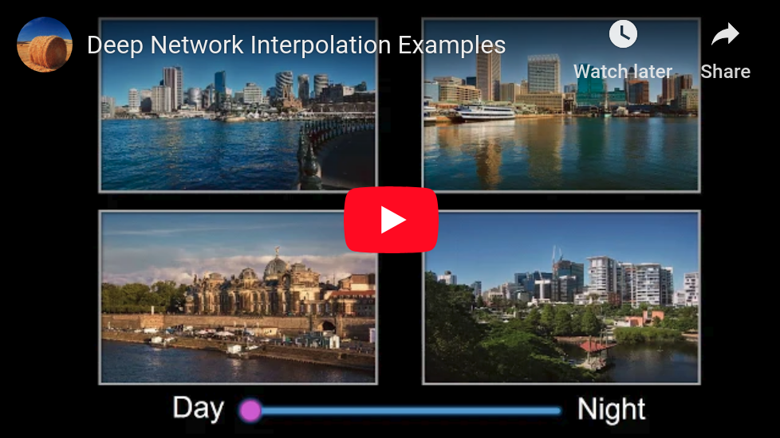

# Deep Network Interpolation [[Paper]](https://arxiv.org/abs/1811.10515) [[Project Page]](https://xinntao.github.io/projects/DNI) 
### Deep Network Interpolation for Continuous Imagery Effect Transition
By [Xintao Wang](https://xinntao.github.io/), [Ke Yu](https://yuke93.github.io/), [Chao Dong](https://scholar.google.com.hk/citations?user=OSDCB0UAAAAJ&hl=en), [Xiaoou Tang](https://scholar.google.com/citations?user=qpBtpGsAAAAJ), [Chen Change Loy](http://personal.ie.cuhk.edu.hk/~ccloy/)

#### BibTeX
    @Article{wang2018dni,
        author={Wang, Xintao and Yu, Ke and Dong, Chao and Tang, Xiaoou and Loy, Chen Change},
        title={Deep network interpolation for continuous imagery effect transition},
        journal={arXiv preprint arXiv:1811.10515},
        year={2018}
    }

<p align="center">
  
</p>

The following is a YouTube video showing several DNI examples. See [our paper](https://arxiv.org/abs/1811.10515) or the 
[project page](https://xinntao.github.io/projects/DNI) for more applications.

<p align="center">
<a href="https://www.youtube.com/watch?v=8HkXZPcxK9c" target="_blank">
   
</a></p>

### Highlights
1. We propose a simple yet universal approach - deep network interpolation, for smooth and **continuous imagery effect transition without further training**.
2. Different from previous works operating in the feature space, we make an attempt to investigate **the manipulation in the parameter space** of neural networks.
3. Our analyses show that learned filters for several related tasks exhibit continuous changes. We believe that it is worth exploiting the **underlying correlations of learned filters** to further extend the ability and practicality of existing models.

## DNI
DNI is simple and can be implemented with seven lines of code.
```python
alpha = 0.3  # interpolation coefficient
net_A = torch.load('path_to_net_A.pth')
net_B = torch.load('path_to_net_B.pth')
net_interp = OrderedDict()
for k, v_A in net_A.items():
  v_B = net_B[k]
  net_interp[k] = alpha * v_A + (1 - alpha) * v_B
```
